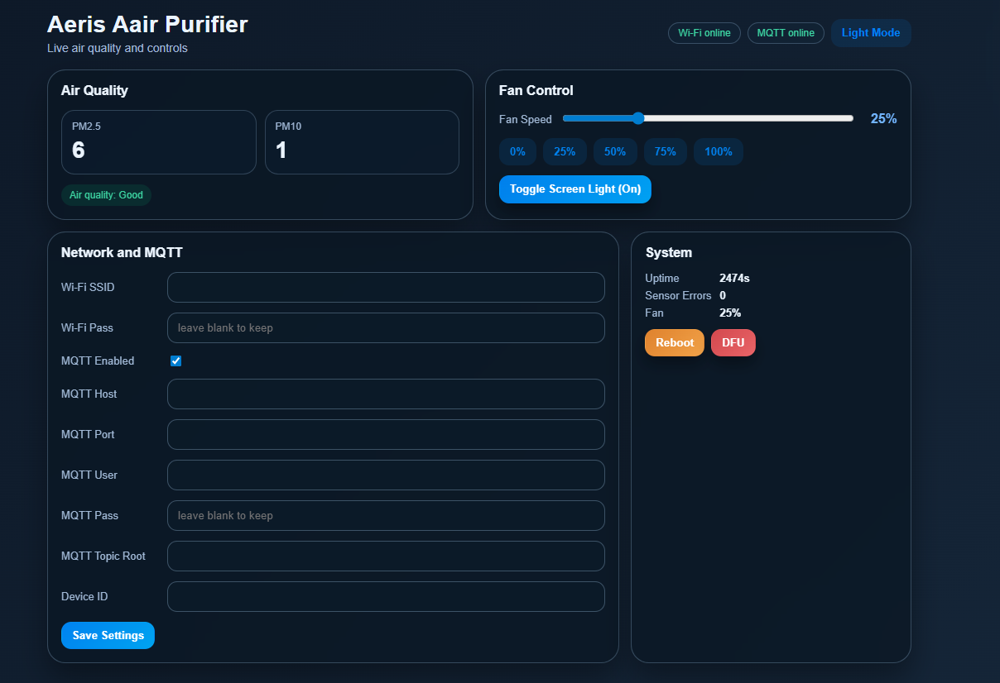

# Aeris AAIR Air Purifier Firmware (Particle Photon)

Firmware for an Aeris AAIR air purifier retrofit running on a `Particle Photon`.

## Inspiration

This project is inspired by:
- https://github.com/mjaymeyer/aeris-aair-home-assistant

In particular, the PM/AQI value reading direction and integration approach were informed by that project.

## What This Firmware Includes

- Fan control via PWM
- PM2.5 / PM10 sensor parsing over `Serial1`
- Local web configuration/API (`/api/v2/...`)
- MQTT command/state interface (`aeris/v2/<device_id>/...`)
- SoftAP setup flow for Wi-Fi onboarding

## Feature Set (v1.0.0)

Public release tag is `v1.0.0`; interface namespace in firmware is currently `v2`.

### Control and On-Device UX

- Fan speed control from `0..100%` with PWM output on `D0`.
- Power toggle with saved-speed restore when turning back on.
- Panel light toggle and dedicated screen backlight (`screen_light`) control.
Physical button behavior:
- `D1`: short press fan `+5%`
- `D2`: short press fan `-5%`
- `D3`: short press toggle lights
- `D3`: long press `>=5s` toggle Wi-Fi enable/disable
- `D4`: short press toggle power
- `D4`: long press `>=8s` clear Wi-Fi credentials and reboot
- TFT runtime UI for fan/PM values and Wi-Fi status.
- Setup-mode TFT UI shows SoftAP SSID and setup target IP.

### Sensor and Data Pipeline

- PM data ingest from `Serial1` at `9600`.
- 32-byte sensor frame parsing with header and checksum validation.
- PM2.5 and PM10 extraction and periodic smoothing before publish/display.
- Sensor watchdog wake sequence when the stream is stale.

### Wi-Fi and Provisioning

- Auto setup-mode (SoftAP) boot when no valid Wi-Fi SSID is stored.
- SoftAP SSID format `Aeris-XXXX`.
- SoftAP setup page flow at `192.168.0.1` for Wi-Fi credential submission.
- Reboot after setup submit to apply new Wi-Fi configuration.
- Wi-Fi can be disabled/enabled without erasing credentials (`D3` long press).

### Exposed Interfaces

- Local Web UI at `GET /`.
- Settings API: `GET /api/v2/settings`, `POST /api/v2/settings`.
- State API: `GET /api/v2/state`.
- Control API: `POST /api/v2/control` (`fan_percent`, `lights`, `screen_light`).
- System API: `POST /api/v2/system/reboot`, `POST /api/v2/system/dfu`.
MQTT command topics:
- `aeris/v2/<device_id>/cmd/fan_percent`
- `aeris/v2/<device_id>/cmd/lights`
- `aeris/v2/<device_id>/cmd/screen_light`
- MQTT state/health topics for fan, PM, uptime, reconnect counters, parse errors, queue drop counters.

### Reliability and Diagnostics

- EEPROM `SettingsV2` with validation (`magic/version/length/CRC32`), sanitize, and defaults fallback.
- Command queueing with per-source drop counters (button/MQTT/web).
- MQTT reconnect backoff and publish-drop tracking.
- Health telemetry includes uptime and reconnect/error counters.

See also:
- `CHANGELOG.md` (`v1.0.0` release notes)
- `docs/architecture.md`
- `docs/interfaces.md`
- `docs/hardware-components-and-interfaces.md`

## Build

From the project root:

```bash
make
```

This runs:

```bash
particle compile photon --saveTo aerisFirmware.bin
```

## Warnings

- Back up your original firmware before flashing anything from this repo.
- Keep your own recovery copy (binary dump + notes for your specific board revision).
- Flashing custom firmware can brick your device, break expected behavior, or void warranty.
- You are responsible for hardware safety, electrical safety, and local compliance.
- DYOR (Do Your Own Research) before wiring, flashing, or deploying this on unattended hardware.

## Flash with Particle USB DFU

1. Connect the Photon with USB.
2. Enter DFU mode (blinking yellow) from CLI:

```bash
particle usb dfu
```

Windows CLI example:

```powershell
particle.exe usb dfu
```

Alternative manual method: hold `SETUP`, tap `RESET`, keep holding `SETUP` until LED turns blinking yellow.
3. Flash the firmware over USB.

Windows example:

```powershell
particle flash --usb C:\dfu\aerisFirmware.bin
```

If your binary is in this repo root, you can also run:

```bash
particle flash --usb aerisFirmware.bin
```

## Button Functions

Button mapping in this firmware:

- `D1` (UP): short press `+5%` fan speed.
- `D2` (DOWN): short press `-5%` fan speed.
- `D3` (EXTRA): short press toggles panel lights; hold `>=5s` toggles Wi-Fi on/off.
- `D4` (POWER): short press toggles purifier power; hold `>=8s` resets Wi-Fi settings and reboots into setup flow.

## Wi-Fi Setup / Reset Flow (SoftAP)

1. Hold the left-side reset button (`D4`) for at least `8` seconds.
2. Device clears saved Wi-Fi credentials and reboots.
3. On reboot, screen enters setup mode and shows SoftAP SSID (for example `Aeris-XXXX`) and target URL/IP (`192.168.0.1`).
4. User connects phone/laptop to that SoftAP SSID.
5. Open the shown URL/IP in browser and submit Wi-Fi credentials.
6. Device reboots automatically and completes Wi-Fi setup.

Tip: hold the lower function button (`D3`) for at least `5` seconds to disable/enable Wi-Fi without wiping credentials.

## Web UI Screenshot



## License

This project uses the license in `LICENSE`.
